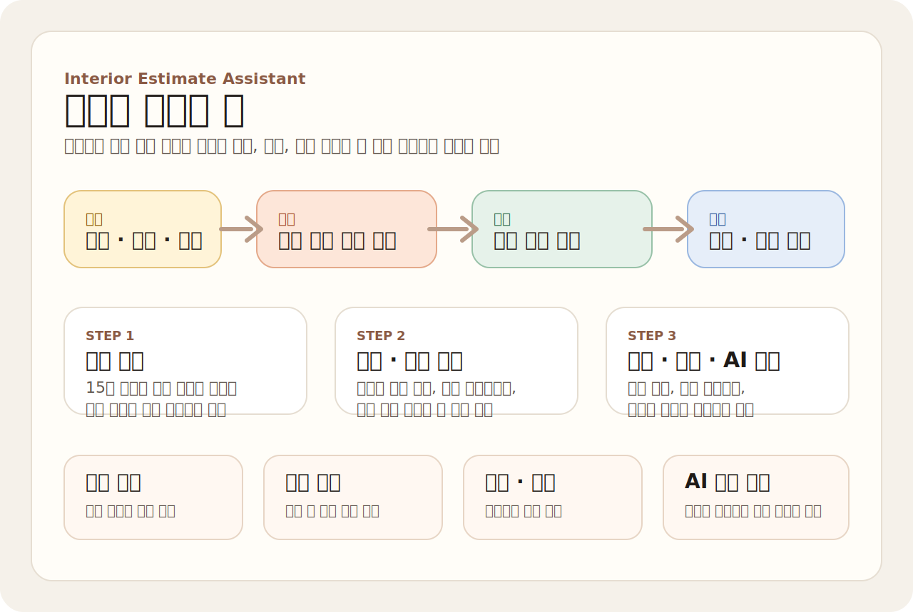
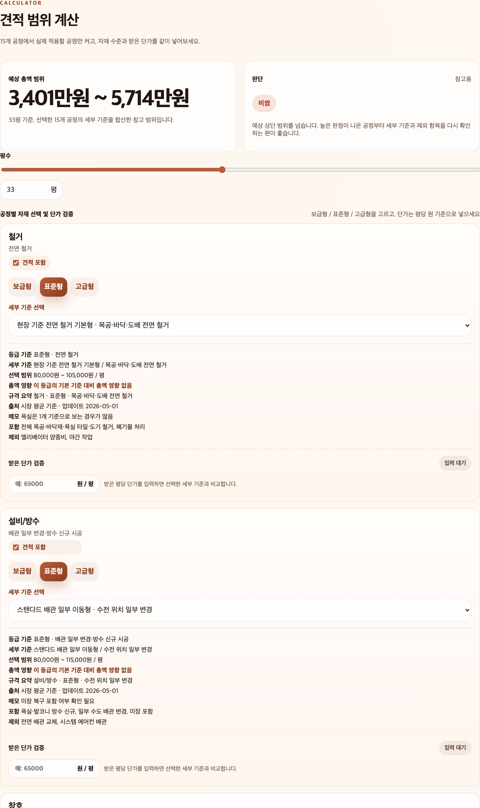
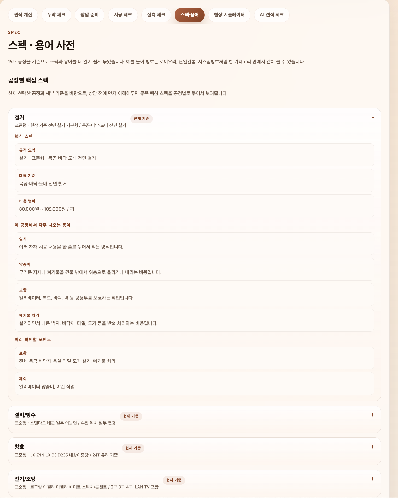
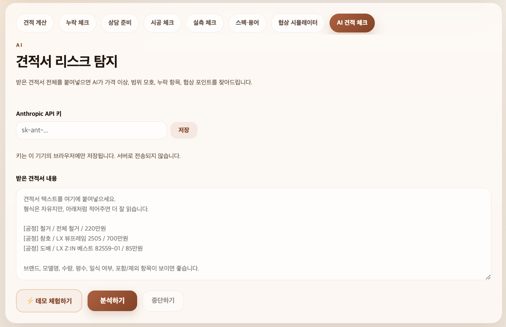

# 견적봄

인테리어 상담이나 비교 견적 전에, 공정별 자재 등급과 평당 단가를 기준으로 예상 견적 범위를 빠르게 확인하는 모바일 우선 웹 도구입니다.

사용자는 평수를 입력하고 공정별 등급을 선택해 적정 견적 범위를 계산할 수 있고, 받은 단가를 기준 데이터와 비교해 높은지 낮은지 바로 점검할 수 있습니다. 추가로 상담 때 바로 쓸 수 있는 질문 리스트와, 견적서 원문을 붙여넣어 리스크를 분석하는 AI 기능도 포함되어 있습니다.

## 서비스 한눈에 보기



비교 견적을 받기 전후로 필요한 흐름을 한 화면 안에 모았습니다.

- 견적 계산: 평수와 공정별 자재 수준으로 예상 총액 범위를 계산
- 누락 체크: 견적서에 빠지기 쉬운 항목과 기본 포함 범위를 점검
- 상담 준비: 미팅 전에 바로 물어볼 질문과 체크포인트 정리
- 실측 체크: 현장 방문 전 필요한 확인 항목 정리
- 스펙·용어: 자재 스펙과 용어를 초보자도 이해하기 쉽게 확인
- 협상 시뮬레이터: 받은 견적을 바탕으로 협상 포인트를 정리
- AI 견적 체크: 견적서 텍스트에서 이상 신호와 리스크를 분석

## 주요 기능

- 15개 공정 기준의 공정별 단가 데이터 제공
- 보급형 / 표준형 / 고급형 등급별 예상 견적 범위 계산
- 받은 평당 단가와 기준 범위 비교
- 누락 가능 항목 및 상담 질문 체크리스트 제공
- 로컬 Claude/Codex 구독 세션을 이용한 견적서 텍스트 리스크 분석
- 발표용 자료 `decks/interier-hackathon/` 포함

## 파일 구성

- `index.html`: 앱 UI 구조
- `styles.css`: 전체 스타일
- `prices.js`: 공정별 기준 단가, 포함/제외 범위, 질문 데이터
- `grade-decoder.js`: 계산기와 체크리스트 동작 로직
- `ai-analyzer.js`: 로컬 AI 프록시 연동 및 견적서 분석 로직
- `scripts/ai-local-proxy.js`: 로그인된 Claude/Codex CLI를 호출하는 로컬 프록시
- `decks/interier-hackathon/`: 발표 슬라이드와 PDF

## 실행 방법

별도 빌드 과정 없이 정적 파일로 실행할 수 있습니다.

1. 프로젝트를 내려받습니다.
2. `index.html`을 브라우저에서 엽니다.
3. 또는 간단한 로컬 서버로 실행합니다.

예시:

```bash
python3 -m http.server 8000
```

그 후 브라우저에서 `http://localhost:8000`으로 접속하면 됩니다.

## 화면
견적 계산







## AI 분석 사용

- Claude 또는 Codex CLI에 먼저 로그인합니다.
- 터미널에서 `npm run ai-local`을 실행합니다.
- 앱의 `AI 견적 체크` 영역에서 `내 Claude로 분석` 또는 `내 Codex로 분석`을 누릅니다.
- 받은 견적서 텍스트를 붙여넣고 분석을 실행합니다.
- 분석 결과는 가격 이상, 범위 모호, 누락 항목, 협상 포인트 중심으로 정리됩니다.
- API 키는 브라우저에 저장하지 않습니다. 로컬 프록시가 이 기기에 로그인된 CLI만 호출합니다.

## 참고

- 본 프로젝트의 계산 결과는 참고용 추정치입니다.
- 실제 견적은 현장 조건, 브랜드, 시공 범위, 지역, 철거 상태 등에 따라 달라질 수 있습니다.
